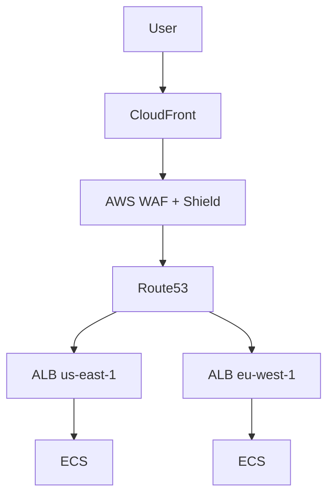

# 🌍 Production-Hardened Multi-Region AWS Platform (Terraform)

**Enterprise-grade, ready-to-run AWS platform blueprint**  
Built for **high availability, global scale, security, disaster recovery, and cost optimization**

---

## ✨ Overview

This repository provides a **production-hardened Terraform reference architecture** for running mission-critical workloads on AWS across multiple regions.

It combines two proven patterns:

- 🌐 **Global High-Availability Load Balancing** (CloudFront + Route53 + ALB)
- 🏗️ **Multi-Region Application Platform** (ECS, DR, CI/CD, Security)

Designed for teams that **expect failure** and engineer systems that survive outages.

---

## 🏗️ Architecture Highlights

- CloudFront (Tier-0 Global LB)
- AWS WAF + Shield Advanced
- Multi-Region ECS (Fargate)
- Active-Passive DR
- Route53 latency routing
- Cross-region backups
- WebSocket support
- GitHub Actions CI/CD

---

## 📐 Architecture Diagram

---

## 🔒 Security

- Edge protection
- Private networking
- Secrets Manager

---

## 🔁 Disaster Recovery

Active-Passive with Route53 failover.

---

## 💥 Chaos Engineering

AWS Fault Injection Simulator supported.

---

