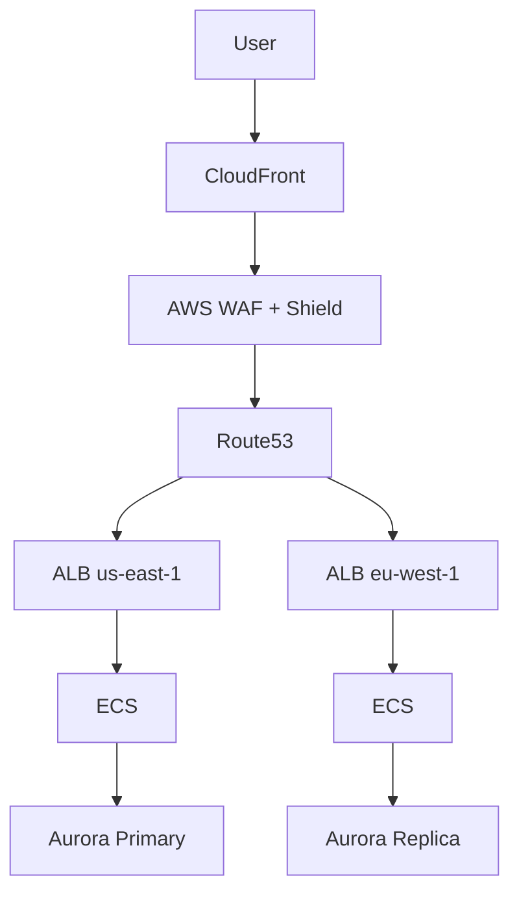

# 🌍 Production-Hardened Multi-Region AWS Platform (Terraform)

**Enterprise-grade, ready-to-run AWS platform blueprint**  
Built for **high availability, global scale, security, disaster recovery, and cost optimization**

---

## ✨ Overview

This repository provides a **production-hardened Terraform reference architecture** for running mission-critical workloads on AWS across multiple regions.

It combines two proven patterns:

- 🌐 **Global High-Availability Load Balancing** (CloudFront + Route53 + ALB)
- 🏗️ **Multi-Region Application Platform** (ECS, DR, CI/CD, Security)

The platform is designed for teams that **expect failure** and engineer systems that continue to operate through **regional outages, traffic spikes, and deployment errors**.

**Ideal for:** SaaS platforms, FinTech, Gaming, real-time systems, and regulated workloads.

---

## 🏗️ Architecture Highlights

- CloudFront as the global **Tier-0 entry point**
- AWS WAF + Shield Advanced for edge security and DDoS protection
- Multi-Region ECS (Fargate) compute
- Cost-optimized **Active-Passive Disaster Recovery**
- Route53 latency & health-based routing
- Cross-region encrypted backups
- WebSocket real-time architecture
- GitHub Actions CI/CD pipelines

---

## 📊 Availability & Reliability Targets

| Metric | Target |
|------|-------|
| Single ALB (AWS SLA) | ~99.99% |
| Multi-Region Platform (Observed) | Near zero customer-visible downtime |
| Published Platform SLO | **99.95%** |

---

## 🌍 Global Multi-Region Architecture

Netflix-style **multi-tier global load balancing** with isolated failure domains.

---

## 🎬 Netflix-Style Multi-Tier Load Balancing

### Tier 0 — Global Load Balancer
- CloudFront
- AWS WAF (Global)
- AWS Shield Advanced

### Tier 1 — Regional Load Balancers
- Route53 latency + health routing
- Public ALB per region

### Tier 2 — Service Load Balancers
- Internal ALBs
- ECS Service Discovery
- Optional App Mesh

---

## ⚖️ Traffic Shaping

- CloudFront origin failover
- Route53 weighted routing
- ALB weighted target groups
- ECS Blue/Green deployments

---

## 📐 Global Architecture Diagram



---

## 🔒 Security Model

- CloudFront + AWS WAF
- Shield Advanced
- Private subnets only
- Secrets Manager

---

## 🔁 Disaster Recovery

Active-Passive using Route53 health checks.

---

## 🌐 Active-Active (Optional)

Latency-based routing with multi-writer databases (Aurora Global / DynamoDB Global Tables).

---

## 💾 Backups

- AWS Backup
- Cross-region vault replication
- Encrypted snapshots

---

## 🔌 WebSocket Architecture

- API Gateway (WebSocket)
- Lambda connection management
- ECS backend workers

---

## 🚀 CI/CD

- Terraform via GitHub Actions
- ECS Blue/Green deployments
- Canary & linear traffic shifting

---

## 🧠 SLO & Error Budget

- Availability SLO: **99.95%**
- Error budget: ~21.6 minutes/month

---

## 💥 Chaos Engineering

- AWS Fault Injection Simulator
- ECS task termination
- AZ & regional failover tests

---

## 📁 Repository Structure

```text
repo/
├── .github/workflows/
├── global/
├── regions/
├── modules/
└── README.md
```

---

## 📜 License

MIT License
