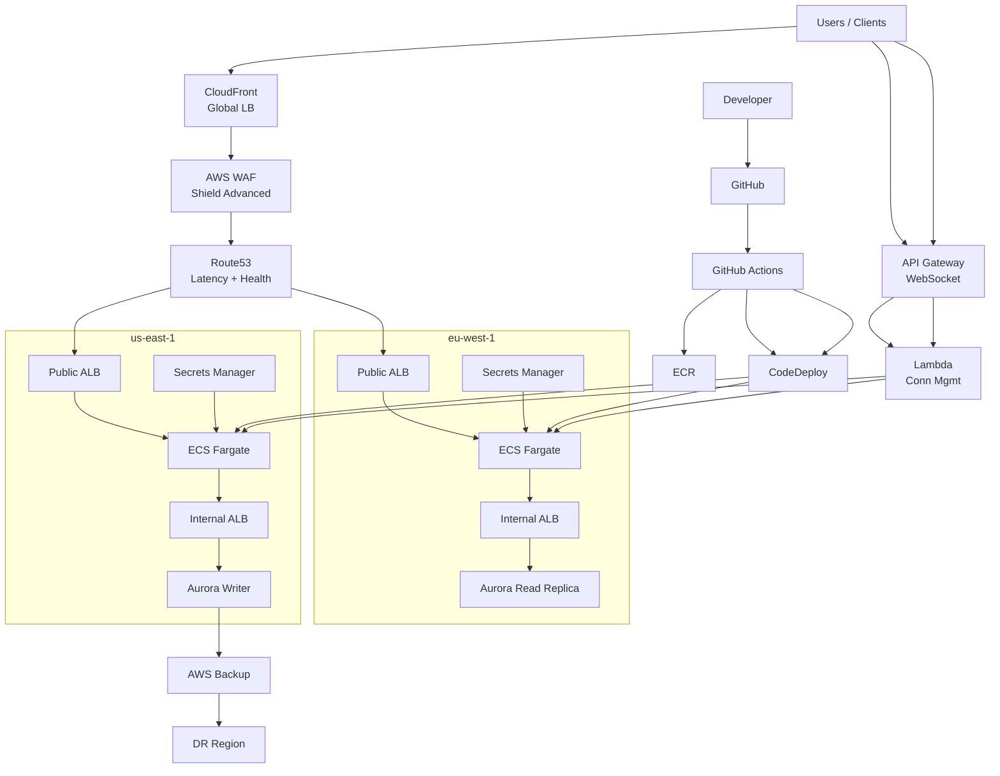

# 🌍 Production-Hardened Multi-Region AWS Platform (Terraform)

**Enterprise-grade, ready-to-run AWS platform blueprint**  
Built for **high availability, global scale, security, disaster recovery, and cost optimization**

---

## ✨ Overview

This repository provides a **production-hardened Terraform reference architecture** for running mission-critical workloads on AWS across multiple regions.

It combines two proven patterns:

- 🌐 **Global High-Availability Load Balancing** (CloudFront + Route53 + ALB)
- 🏗️ **Multi-Region Application Platform** (ECS, DR, CI/CD, Security)

Designed for teams that **expect failure** and engineer systems that continue to operate through **regional outages, traffic spikes, and deployment errors**.

---

## 🏗️ Architecture Highlights

- CloudFront as the global **Tier-0 entry point**
- AWS WAF + Shield Advanced for edge security and DDoS protection
- Multi-Region ECS (Fargate)
- Cost-optimized **Active-Passive DR**
- Route53 latency & health-based routing
- Cross-region encrypted backups
- WebSocket real-time support
- GitHub Actions CI/CD pipelines

---

## 📐 Full AWS Architecture & CI/CD Diagram

---

## 🚀 CI/CD Flow

1. Developer pushes code to GitHub
2. GitHub Actions builds container
3. Image pushed to ECR
4. CodeDeploy performs ECS Blue/Green
5. Traffic shifted via ALB
6. Automatic rollback on alarms

---

## 🔒 Security

- CloudFront + AWS WAF
- Shield Advanced
- Private subnets only
- No public compute
- Secrets Manager per region

---

## 🔁 Disaster Recovery

Active-Passive using Route53 health checks.  
DR region runs **zero steady-state compute**.

---

## 💥 Chaos Engineering

- AWS Fault Injection Simulator
- ECS task termination
- AZ impairment
- Regional failover tests

---

## 📜 License

MIT License
